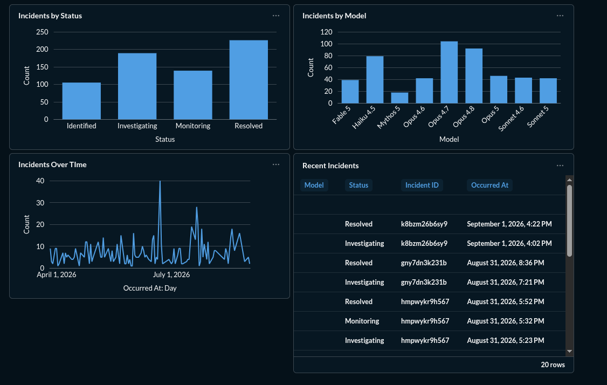

# Claude Monitor

A self-hosted data pipeline that ingests Anthropic Claude status emails, parses incident data, and visualizes it in Metabase.

```
Gmail (IMAP) → Fetch → pandas Transform → PostgreSQL → Metabase
```

## Architecture

```
main.py
  ├── fetch_emails()   → raw email records
  ├── transform()      → pandas DataFrame
  └── loader()         → PostgreSQL
```

Separation of concerns: fetching, transformation, and loading are independent modules, coordinated by `main.py`. The pipeline runs in a loop with a 1-hour polling interval.

## Project Structure

```
claude-monitor/
├── app/
│   ├── email/fetch.py
│   ├── etl/transform.py
│   ├── etl/loader.py
│   └── etl/database.py
├── main.py
├── Dockerfile
├── docker-compose.yml
├── requirements.txt
└── .env
```

## Duplicate-Safe Ingestion

Two layers of protection against reprocessing emails:

1. **Incremental fetch** — tracks the last processed email ID, so only newer emails are fetched each cycle.
2. **DB-level constraint** — each row has a unique `slug`. Inserts use `ON CONFLICT DO NOTHING`, so re-running ingestion never creates duplicates.

Verified against the full mailbox: 726 emails in → 726 rows in Postgres, with no duplicates on re-run.

## Database Schema (`Claude Entries`)

| Field       | Purpose                                  |
|-------------|-------------------------------------------|
| ID          | Row identifier                            |
| Email ID    | Source email identifier                   |
| Model       | Claude model referenced in the incident   |
| Occurred At | Time the incident occurred                |
| Status      | Incident status                           |
| Incident ID | Claude status page incident ID            |
| Updated At  | Last update timestamp                     |
| Slug        | Unique key used for dedup                 |

Some emails omit model/status — treated as legitimate source-data gaps, not ETL bugs.

## Networking (Docker)

- **Container-to-container**: `<postgres-service-name>:5432`
- **Host-to-container**: `<host-ip>:5433`

Don't mix these up — `5433` is only relevant when connecting from outside the Docker network.

## Running It

```bash
docker compose build
docker compose up -d
docker logs -f <app-container-name>
```

## Dashboard

Four Metabase panels: incidents by status, incidents by model, incidents over time, and a recent-incidents table.



## Stack

Python · IMAP · pandas · SQLAlchemy · PostgreSQL · Docker · Metabase

## Security

`.env`, credentials, and passwords are never committed. `.gitignore` covers `.env`, `__pycache__/`, `*.pyc`. Rotate any credential that leaks into Git history.

## Possible Next Steps

- Better failure alerting
- Dashboard filters
- Data quality checks
- Automated tests